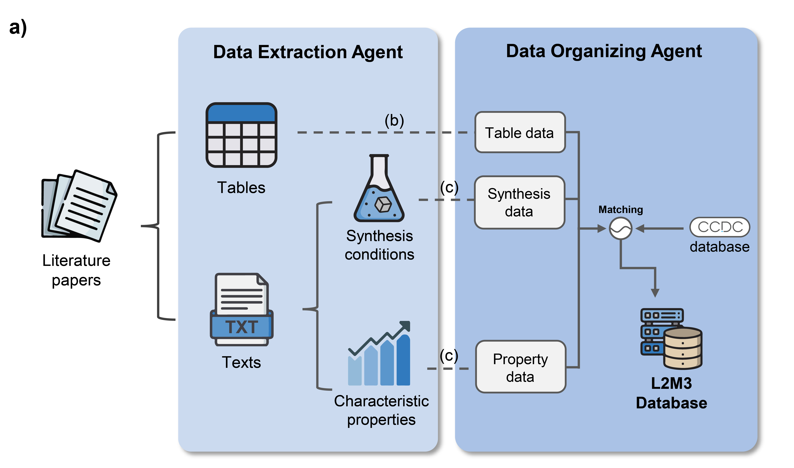
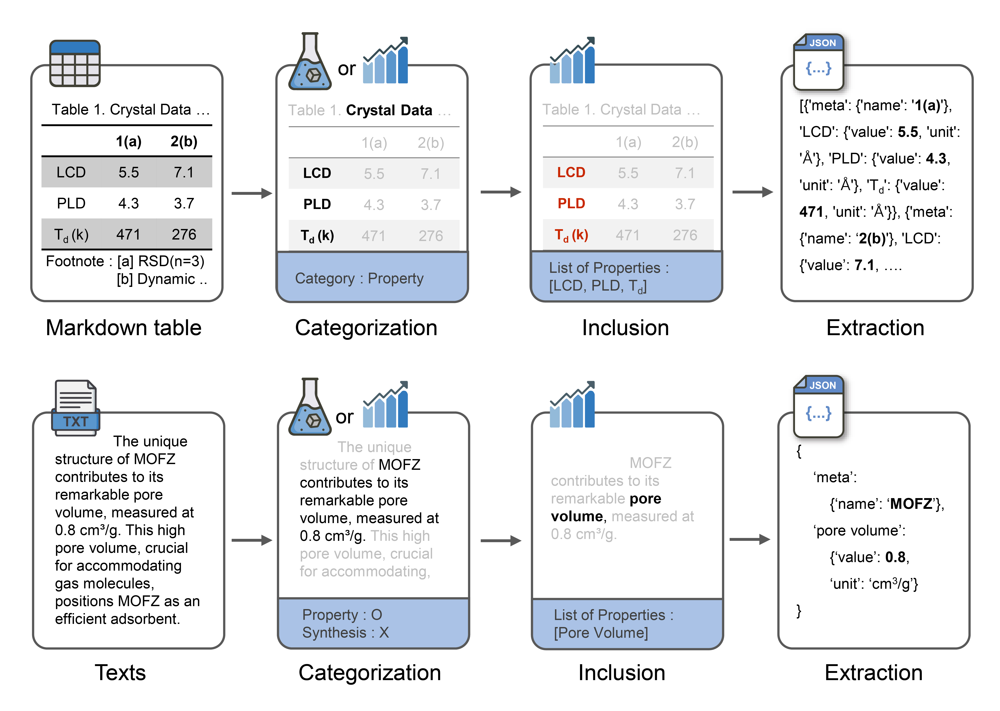

<div align="center">
<h1> ⛏L2M3: Large Language Models Material Miner </h1> 
</div>



## Summary
This project focuses on efficiently collecting experimental Metal-Organic Framework (MOF) data from scientific literature to overcome the challenges of accessing elusive data and to improve the quality of information available for machine learning applications in materials science. By leveraging a chain of advanced Large Language Models (LLMs), we developed a systematic approach to extract and organize MOF data into a structured and usable format. Our methodology successfully compiled information from over 40,000 research articles, resulting in a comprehensive, ready-to-use dataset. This dataset includes MOF synthesis conditions and properties, extracted from both **tables and text data**, which were subsequently analyzed. 


## Process

.

Our L2M3 empolys 3 specialized agent:
- **Categorization**: the agent that classifies the table and texts based on whether they describe a property, a synthesis condition, or contain no relevant information.
- **Inclusion**: the agent that determine the specific information present.
- **Extraction**: the agent that extract information as JSON type.

## Installation

**NOTE**: This package is primarily tested on Linux system. We strongly recoomend using Lunux for installation.
**NOTE2**: This package require python >= 3.9

```bash
$ git clone https://github.com/Yeonghun1675/L2M3.git
$ cd L2M3
$ pip install -e .
```

## How to use 

### JournalReader
`JouralReader` is python class that obtain clean text and meta data from xml/html file.

```python
from llm_miner import JournalReader

file_path = 'path-to-your-xml/html-file'
publisher = 'your-publisher'  # list of  publisher: ['acs', 'rsc', 'elsevier', 'springer']

jr = JournalReader.from_file(file_path, publisher=publisher)
```

`journalreader` has several useful attributes.
- `doi` : doi of paper
- `title` : title of paper
- `url` : url of paper
- `get_tables` : list of tables
- `get_texts` : list of paragraphs
- `get_figures`: list of figure captions

Also, you can write and load `journalreader` as json type.
```python
# save journal reader
jr.to_json('output_file_path.json')

# load journal reader
jr_load = JournalReader.from_json('input_file_path.json')
```

### Mining Agent
LLM miner is from file

```python
from llm_miner import LLMMiner

api_key = 'openai-api-key'
agent = LLMMiner.from_config(...)

```

You can run agent. Output of datamining is saved in `jr`.

```python
agent.run(
    paragraph=paper,
)
```

You can check results in papers
```python
jr.paper
```


### Token Checker
We provide token checker that estimate tokens and price of your text-mining task.

```python
from llm_miner.pricing import TokenChecker

tc = TokenChecker()
...
agent.run(
    paragraph=output,
    token_checker=tc
)
```

## Fine-tuning
You have to fine tuning to all i want to use.
pass


## Citiation
If you want to cite PMTransformer or MOFTransformer, please refer to the following paper:
- [Harnessing Large Language Model to collect and analyze Metal-organic framework property dataset, arxiv (2024)](https://arxiv.org/abs/2404.13053)

## Contributing 🙌

Contributions are welcome! If you have any suggestions or find any issues, please open an issue or a pull request.

## License 📄

This project is licensed under the MIT License. See the `LICENSE` file for more information.
