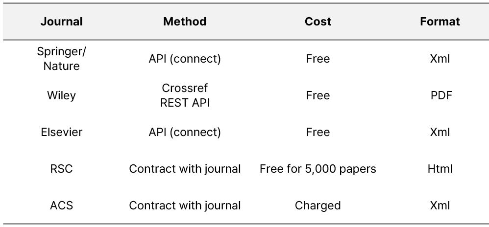

# Journal Crawling

We obtained journal articles in compliance with each publisher's Text and Data Mining (TDM) policy. For certain journals, we directly contacted the publisher to arrange downloads. The specific details for each journal are outlined below:

### Accessing Journals Through Your Institution
Your university library likely has agreements with various publishers. Contact your institution's library to obtain more information on journal access and downloading policies.

### Text and Data Mining Policies by Publisher
- **Elsevier:** [TDM Policy](https://dev.elsevier.com/)
- **ACS:** [TDM Access](https://solutions.acs.org/solutions/text-and-data-mining/#access)
- **Wiley:** [TDM Resources](https://onlinelibrary.wiley.com/library-info/resources/text-and-datamining)
- **Springer:** [TDM Information](https://www.springernature.com/gp/researchers/text-and-data-mining)
- **RSC:** [TDM Guidelines](https://www.rsc.org/journals-books-databases/research-tools/text-and-data-mining/)

### Reference Resources for Implementing Crawling
To adhere to copyright regulations, we do not provide direct crawling scripts. However, the following resources may serve as useful references for developing your own code:
- [Elsevier API Documentation](https://dev.elsevier.com/api_docs.html)
- [CrossRef API](https://api.crossref.org/swagger-ui/index.html)
- [Springer Nature API Documentation](https://dev.springernature.com/docs/introduction/)

### Get DOI and Journal Information
You can retrieve DOI and journal information using the following code repository: [DOI Search](https://github.com/Yeonghun1675/doi_search). This allows you to search for keywords in Scopus and download DOIs efficiently.
