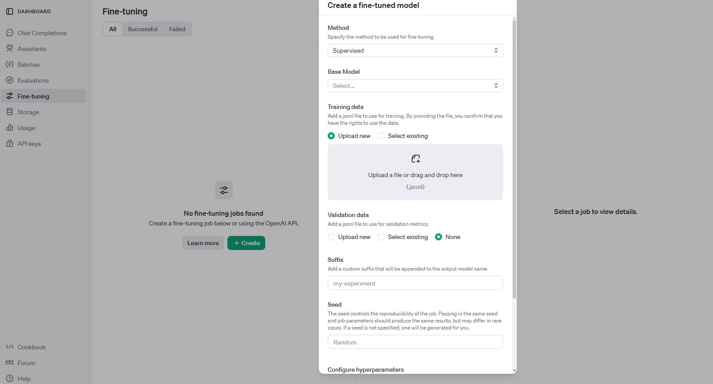

# Synthesis Condition Recommender


## How to use
### 1. fine-tuned model
In order to use the synthesis recommender, the openai chatgpt model must be fine-tuned. First, download one of the train jsonl files located in assets. Then, upload the jsonl file to the fine-tuning section of openai for fine-tuning [[link]](https://platform.openai.com/finetune).



**! In this step, you will be charged a lot of OPENAI API fees (you may be charged around 100$ for one training).**

When all training is finished, the name of the fine-tuned model is generated.


### 2. change config.yaml
In the `config.yaml` file, enter the `openai api key` and the name of `fine-tuned model`. If you want the input to be in natural language, set `input_as_text` to true. If you want to provide it directly as a list, set it to false. Also you can change other options like temperature in GPT.

### 3. Run sythesis recommender
```bash
$ python synthesis_recommender.py
```